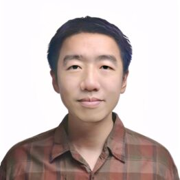
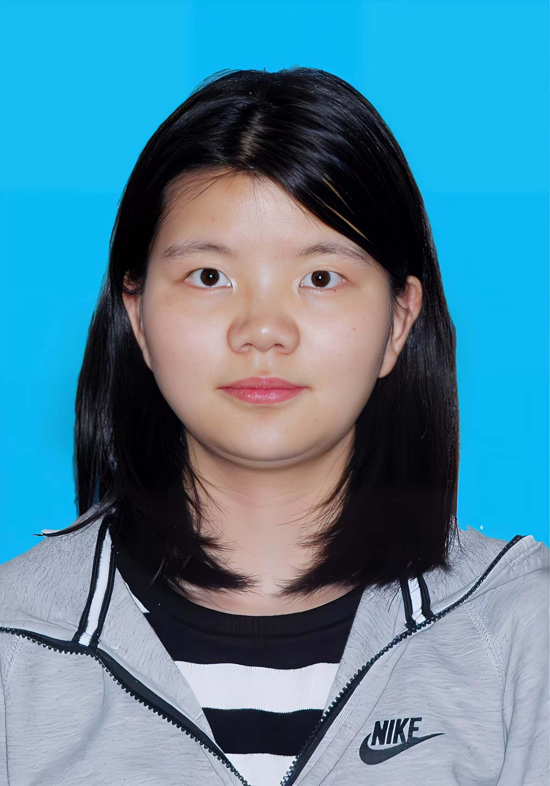
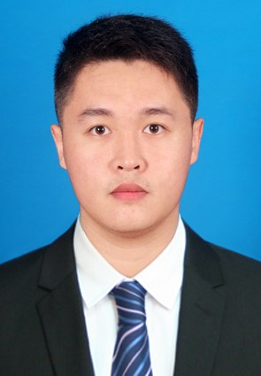
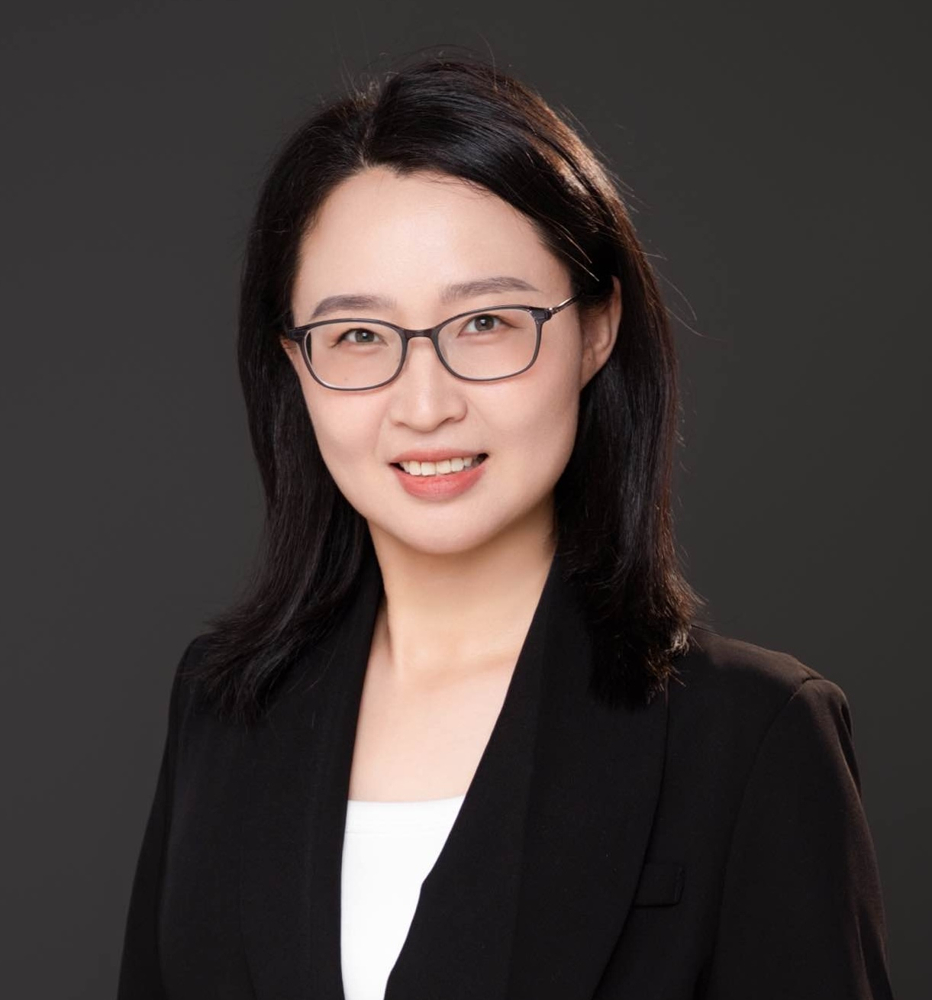
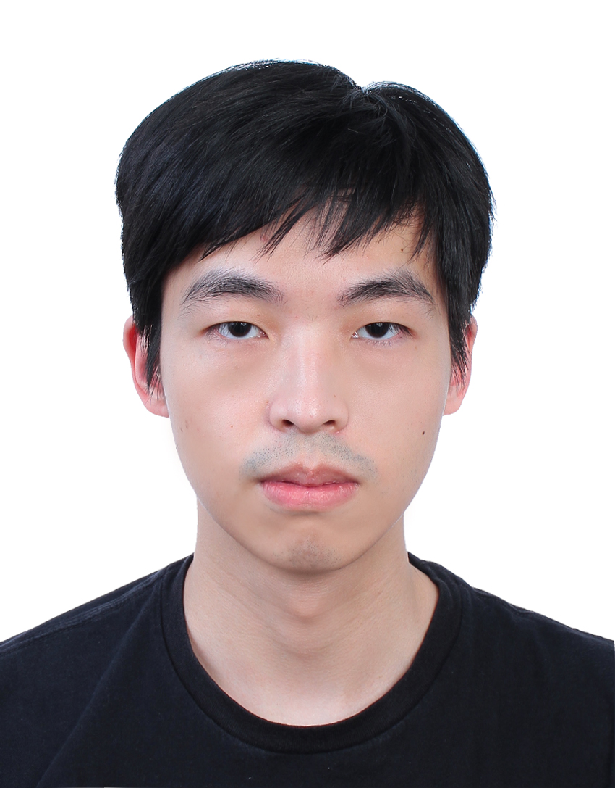
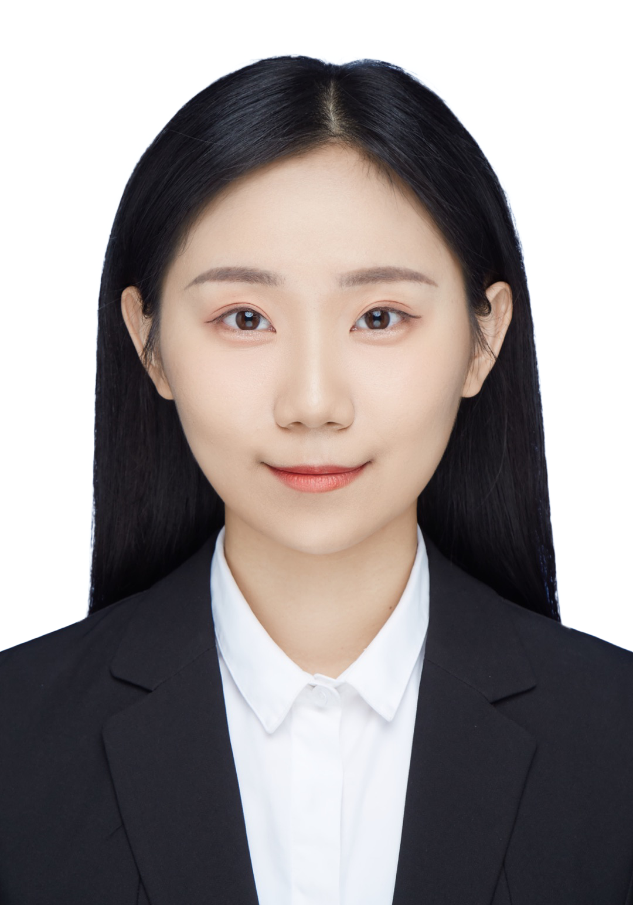
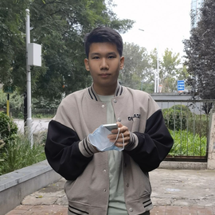
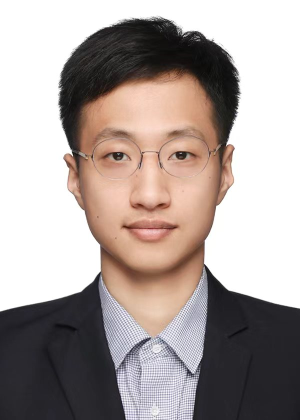

# Contributors

## Core Team

### DevTech

Joey Wang, NVIDIA DevTech Compute Manager

Wenjing Zhu, NVIDIA DevTech Compute Manager

Kingsley Liu, NVIDIA DevTech Compute Engineer

Hui Kang, NVIDIA DevTech Compute Engineer

### Product Team

Vikas Sharma

### SA

Rita Zhang, Director, Research and OSS Developer Relationship, High Education Research and Energy Industry

Dikai Liu, NVIDIA AI Technology Center, Solution Architect

Jieming Cui, NVIDIA Solution Architect; PhD Student, PKU Institute for Artificial Intelligence

Xiang Xiao, NVIDIA Solution Architect

### PKU

Yixin Zhu, Assistant Professor, PKU School of Psychological and Cognitive Sciences, PKU Institute for AI

Zhenghao Qi, Undergraduate in Department of Automation, Tsinghua University

### TJU

Bin He, Professor, Shanghai Research Institute for Intelligent Autonomous Systems, Tongji University

Yifei Zhao, PhD Student, Shanghai Research Institute for Intelligent Autonomous Systems, Tongji University

