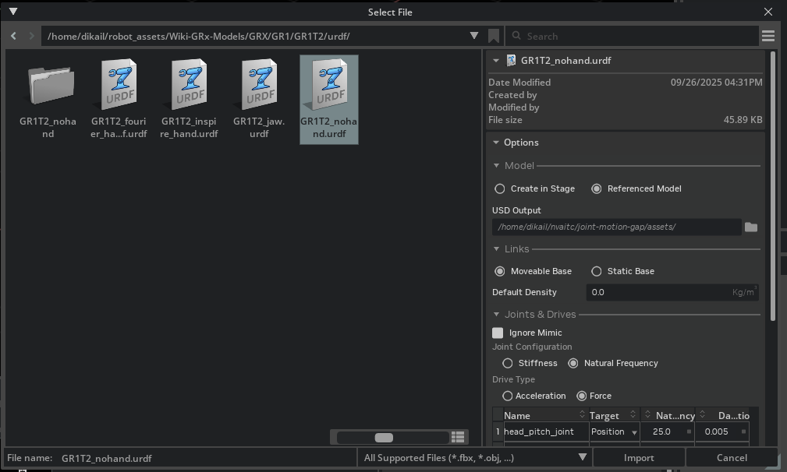
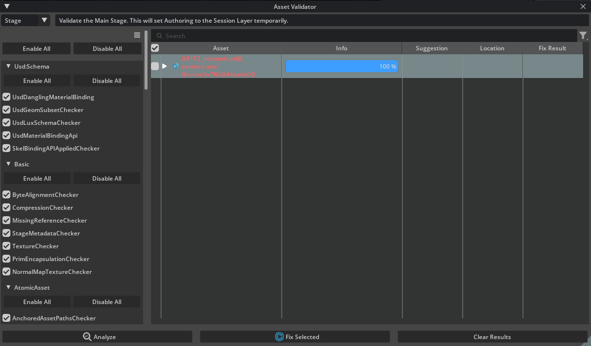
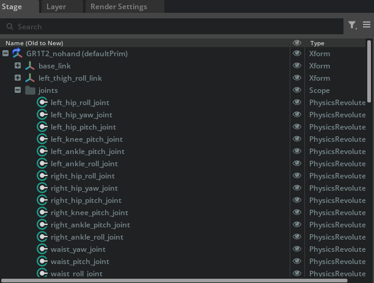
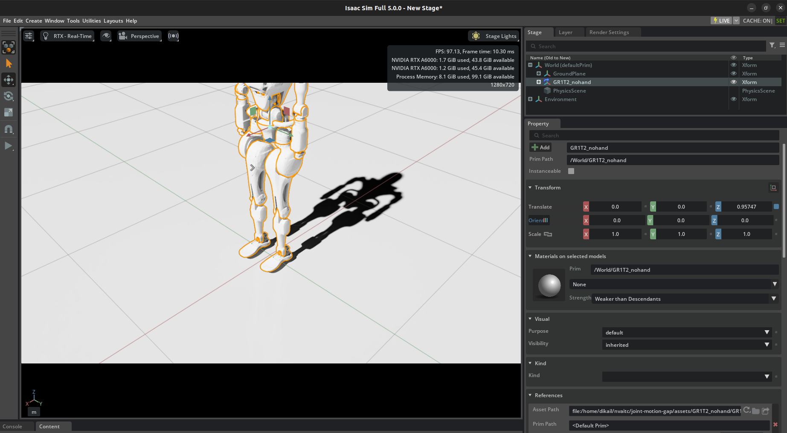

# Guide to Add a New Robot

This document provides a comprehensive minimal guide for adding a new robot to the SAGE project. We use the **Fourier GR1T2** robot as an example throughout this guide.

## Prerequisites

- Isaac Sim installed and configured
- Access to robot URDF files and meshes
- Basic familiarity with Isaac Sim interface

## File Path Convention

Throughout this document:

- `<REPO_ROOT>` refers to your SAGE project root directory
- **GR1T2** is used as the example robot name throughout the guide

**Important:** When following this guide for your robot, replace:

- `<REPO_ROOT>` with your actual project path
- `gr1t2` with your robot name (lowercase) in all configurations, commands, and file paths

**Example:**

- If your project is at `/home/user/sage/` and your robot is "atlas"
- Then `<REPO_ROOT>/configs/gr1t2_valid_joints.txt` becomes `/home/user/sage/configs/atlas_valid_joints.txt`

## Step 1: Prepare New Robot Asset

All robot assets are stored under the `<REPO_ROOT>/assets` folder. The robot asset must be in **USD format** for compatibility with Isaac Sim.

> **Tip:** If your robot is available in the [Isaac Sim Robot Assets](https://docs.isaacsim.omniverse.nvidia.com/latest/assets/usd_assets_robots.html), use it directly with the corresponding placeholder. Otherwise, proceed with the conversion steps below.

### 1.1 Convert from Existing Model

The robot asset needs to be in **USD format**. Isaac Sim provides various tools to import from different robot representations, including **URDF**, **MJCF**, and direct import from selective CAD platforms. For details, please refer to the [official Isaac Sim documentation](https://docs.isaacsim.omniverse.nvidia.com/latest/importer_exporter/importers_exporters.html).

**Example with GR1T2:**
The GR1T2 model can be retrieved from [Fourier's GitHub repository](https://github.com/FFTAI/Wiki-GRx-Models).

1. **Download the robot model** (e.g., GR1T2 URDF and mesh files)
2. **Place the model files** in a temporary folder
3. **Open Isaac Sim** and use the URDF Importer:
   - Go to `File > Import`
   - Select your URDF file (e.g., `GR1T2_nohand.urdf`)
   - Configure import settings in **Options**:
     - Set **Output Directory** to `<REPO_ROOT>/assets`
     - Select **Reference Model**
     - Select **Moveable Base**
     - Configure **Joint & Drives** and **Colliders** properties if necessary
4. **Click Import** and wait for the process to complete

 \
_Figure 1: URDF Import Settings in Isaac Sim_

### 1.2 Validate Asset

After converting to USD format, use Isaac Sim's **Asset Validator** to check for critical issues:

1. **Open Isaac Sim**
2. **Load your USD asset** (`<REPO_ROOT>/assets/GR1T2_nohand/GR1T2_nohand.usd`)
3. **Run [Asset Validator](https://docs.omniverse.nvidia.com/extensions/latest/ext_asset-validator.html)**:
   - Go to `Window > Asset Validator` (or first enable it in `Window > Extensions`)
   - Select the validation to run
   - Click "Analyze"
   - **Fix any critical errors** that appear (typically related to materials, physics properties, or joint configurations)
   - Save the file for any changes

 \
_Figure 2: Asset Validator Results_

### 1.3 Identify and Document Joint Names

**Critical Step:** You need to identify all joint names to be used for later configuration.

1. **Load the USD asset** in Isaac Sim
2. **Open the Stage panel** (`Window > Stage`)
3. **Navigate through the robot hierarchy** and note down all joint names that will be used for motion
   - With the latest version of URDF Importer, all joints are organized under the `joints` scope
   - Expand the robot hierarchy to see all available joints

**Example for GR1T2:**

```
left_shoulder_pitch_joint
left_shoulder_roll_joint
left_shoulder_yaw_joint
left_elbow_pitch_joint
...
```

 \
_Figure 3: Robot Joint Hierarchy in Stage Panel_

### 1.4 Test Initial Robot Z-Offset

**Test the robot positioning** to ensure it spawns correctly above the ground:

1. **Create a new scene** in Isaac Sim (`File > New`)
2. **Add Physics Scene** (`Create > Physics > Physics Scene`)
3. **Add Ground Plane** (`Create > Physics > Ground Plane`)
4. **Add your robot USD** as a reference:
   - Method 1: `File > Add Reference` and select your USD file
   - Method 2: Drag and drop from the Content panel
5. **Adjust initial position** in the Transform properties:
   - Set X and Y to `0.0`
   - Gradually increase Z value until robot is slightly above ground
6. **Run physics simulation** (`Spacebar` or play button) to verify:
   - Robot doesn't fall through the ground
   - Robot doesn't clip into the ground plane
7. **Record the optimal Z-offset value** for use in Step 2

 \
_Figure 4: Robot Z-Offset Testing_

## Step 2: Create Robot Configuration File

The framework uses **IsaacLab's ArticulationCfg** system for robot configuration. This provides fine-grained control over physics properties and actuators.

### 2.1 Create Robot Configuration Module

Create a new Python file for your robot manufacturer: `<REPO_ROOT>/sage/robots/fourier.py`

<details>
<summary><b>Example Configuration Structure for <code>sage/robots/fourier.py</code></b> (click to expand)</summary>

```python
"""Configuration for Fourier robots."""

import isaaclab.sim as sim_utils
from isaaclab.actuators import ImplicitActuatorCfg
from isaaclab.assets import ArticulationCfg

##
# Configuration
##

GR1T2_CFG = ArticulationCfg(
    spawn=sim_utils.UsdFileCfg(
        usd_path="assets/GR1T2_nohand/GR1T2_nohand.usd",
        activate_contact_sensors=True,
        rigid_props=sim_utils.RigidBodyPropertiesCfg(
            disable_gravity=False,
            retain_accelerations=False,
            linear_damping=0.0,
            angular_damping=0.0,
            max_linear_velocity=1000.0,
            max_angular_velocity=1000.0,
            max_depenetration_velocity=1.0,
        ),
        articulation_props=sim_utils.ArticulationRootPropertiesCfg(
            enabled_self_collisions=False,
            solver_position_iteration_count=8,
            solver_velocity_iteration_count=4,
        ),
    ),
    init_state=ArticulationCfg.InitialStateCfg(
        pos=(0.0, 0.0, 0.96),  # Use Z-offset from Step 1.4
        joint_pos={".*": 0.0},  # Default joint positions (all zero)
        joint_vel={".*": 0.0},
    ),
    soft_joint_pos_limit_factor=0.9,
    actuators={
        "arms": ImplicitActuatorCfg(
            joint_names_expr=[
                ".*_shoulder_pitch_joint",
                ".*_shoulder_roll_joint",
                ".*_shoulder_yaw_joint",
                ".*_elbow_pitch_joint",
                ".*_wrist_roll_joint",
            ],
            effort_limit_sim=300,
            stiffness=40.0,  # kp gain
            damping=10.0,    # kd gain
        ),
    },
)
"""Configuration for Fourier GR1T2 humanoid robot."""
```

</details><br>

**Key Configuration Parameters:**

- **`spawn.usd_path`**: Path to your USD file (use the Z-offset from Step 1.4 in `init_state.pos`)
- **`init_state`**: Initial robot pose and joint positions
- **`actuators`**: Define actuator groups with stiffness (kp) and damping (kd) gains

**Additional Resources:**

For comprehensive tutorials and detailed documentation on robot configuration:

- [Adding a New Robot to Isaac Lab Tutorial](https://isaac-sim.github.io/IsaacLab/v2.3.0/source/tutorials/01_assets/add_new_robot.html) - Step-by-step tutorial with examples
- [IsaacLab ArticulationCfg API Documentation](https://isaac-sim.github.io/IsaacLab/v2.3.0/source/api/lab/isaaclab.assets.html#isaaclab.assets.ArticulationCfg) - Complete API reference
- [IsaacLab Actuators Documentation](https://isaac-sim.github.io/IsaacLab/v2.3.0/source/api/lab/isaaclab.actuators.html) - Actuator configuration details

### 2.2 Register Robot in Assets Registry

Update `<REPO_ROOT>/sage/assets.py` to import and register your robot:

1. **Add import statement** at the top (import from the manufacturer module):

```python
from .robots.fourier import GR1T2_CFG
```

2. **Add to `ROBOT_CFGS` dictionary**:

```python
ROBOT_CFGS = {
    # ... existing robots ...
    "gr1t2": GR1T2_CFG,  # Add your robot here
}
```

## Step 3: Create Valid Joints Configuration File

Create a configuration file that specifies which joints should be controlled during simulation.

### 3.1 Create Valid Joints File

Create a new file: `<REPO_ROOT>/configs/gr1t2_valid_joints.txt`

> **Note:** Replace `gr1t2` with your robot name. The config file should be named `<your_robot_name>_valid_joints.txt`

**Format:** One joint name per line, exactly as they appear in the USD asset:

```
left_shoulder_pitch_joint
left_shoulder_roll_joint
left_shoulder_yaw_joint
left_elbow_pitch_joint
left_wrist_roll_joint
right_shoulder_pitch_joint
right_shoulder_roll_joint
right_shoulder_yaw_joint
right_elbow_pitch_joint
right_wrist_roll_joint
```

**Important Guidelines:**

- Include only the joints you want to actively control
- Use exact joint names from Step 1.3
- The system will automatically find and map these joint names to the robot

## Step 4: Prepare Motion Files

Motion files contain the joint trajectories that your robot will follow during simulation.

### 4.1 Directory Structure

Create the following directory structure:

```
<REPO_ROOT>/
└── motion_files/
    └── gr1t2/                    # Robot name folder (replace "gr1t2" with your robot name)
        ├── custom/               # Custom motion category
        │   └── custom_motion.txt
        └── amass/               # AMASS-derived motions
            ├── punch_left01_poses_action_sequence.txt
            └── walk_sequence_poses_action_sequence.txt
```

### 4.2 Motion File Format

To perform a quick test, follow the process below to create your custom motion file at `<REPO_ROOT>/motion_files/gr1t2/custom/custom_motion.txt`.

**Header Line:** Comma-separated joint names (must match your USD joint names)

```
left_shoulder_pitch_joint, left_shoulder_roll_joint, left_shoulder_yaw_joint, ...
```

**Data Lines:** Target joint positions in **radians** for each timestep

```
0.0, -0.1, 0.2, 0.5, 0.0, 0.0, 0.1, -0.2, -0.5, 0.0
0.1, -0.15, 0.25, 0.6, 0.0, 0.0, 0.15, -0.25, -0.6, 0.0
0.2, -0.2, 0.3, 0.7, 0.0, 0.0, 0.2, -0.3, -0.7, 0.0
...
```

**Key Points:**

- Each line after the header represents one timestep
- Values must be in radians (not degrees)
- Number of values per line must match the number of joints in header
- The system will filter to only use joints listed in your valid joints file

### 4.3 Add Custom Motion Source

If you're adding a new motion source category, update the argument parser in `<REPO_ROOT>/scripts/run_simulation.py`:

1. **Locate the argument parser** near the top of the file
2. **Find the `--motion-source` argument** definition
3. **Add your new motion source** to the choices list:

```python
parser.add_argument(
    "--motion-source",
    type=str,
    choices=["amass", "custom", "your_new_source"],  # Add your source here
    required=True,
    help="Source of the motion",
)
```

## Step 5: Test Your New Robot

After completing all steps, test your robot integration:

### 5.1 Run Basic Test

```bash
cd <REPO_ROOT>
${ISAACSIM_PATH}/python.sh scripts/run_simulation.py \
    --robot-name gr1t2 \
    --motion-source custom \
    --motion-files motion_files/gr1t2/custom/custom_motion.txt \
    --valid-joints-file configs/gr1t2_valid_joints.txt \
    --output-folder results \
    --control-freq 50 \
    --motion-speed-factor 1.0 \
    --fix-root
```

> **Note:** Replace `gr1t2` in the command with your robot name and update the motion file path accordingly.

### 5.2 Verify Results

**Check that:**

- Robot spawns correctly above the ground
- All specified joints move according to the motion file
- No error messages about missing joints
- Output files are generated in `<REPO_ROOT>/results/sim/gr1t2/custom/custom_motion/` (path will use your robot name)
  - `joint_list.txt`: Lists controlled joints
  - `control.csv`: Command positions over time
  - `state_motor.csv`: Actual joint states over time
